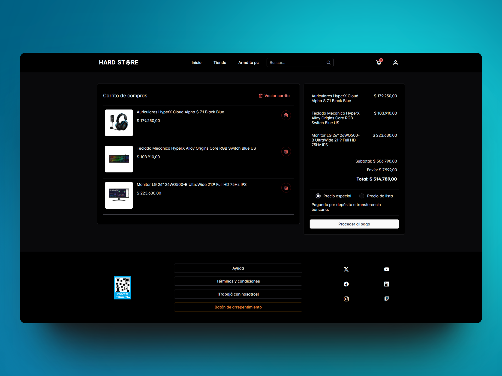

# Online Store

 

  <a href="#Funcionalidades">Funcionalidades</a> •
  <a href="#Tecnologías-utilizadas">Tecnologías utilizadas</a> •
  <a href="#Instalación-y-uso">Instalación y uso</a> •
  <a href="#Contribuciones">Contribuciones</a>

 

Online Store is an online store specializing in PC hardware, peripherals, and everything related. Developed with Angular 17, this app uses Server Side Rendering to improve performance and SEO, is powered by NgRx for efficient state management, and is hosted on Firebase. The user interface is built with PrimeNG and PrimeFlex, providing a modern and responsive experience.

 

 
 

## Funcionalidades

- **Registration and Login**: Users can register and access their accounts.
- **Order and Purchase Management**: Users can manage their orders and purchase history.
- **Favorites**: Users can add products to their favorites list.
- **Product Catalog**: View the full catalog of available products.
- **Filters and Sort**: Filter products by category and sort them according to different criteria.
- **Search Bar**: Quickly search for products using the search bar.
- **Build Your PC Section**: Step-by-step guide to choosing components and building a custom PC.

 

 

 

 

## Tecnologías Usadas

- **Angular 17**: Core framework for front-end development.
- **Server Side Rendering**: Performance and SEO improvements.
- **NgRx**: Application state management.
- **Firebase**: Backend for authentication, databases, and hosting.
- **PrimeNG**: UI components for Angular.
- **PrimeFlex**: CSS utilities for responsive designs.
  
 
